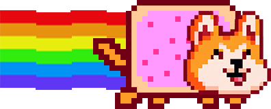

# DogeKZG

[KZG Ceremony client](https://github.com/ethereum/kzg-ceremony) with all the features you never wanted;

- ✅ 200% more un-maintainable code
- ✅ Streamlined with no tests or documentation to bog you down
- ✅ Almost 20mb of pure html, css, javascript and WASM. Fun for the whole family!
- ✅ Golang WASM single threaded monster that compiles with everything including the kitchen sink
- ✅ Music that can't be turned off
- ✅ Tested on at least one device (and it ran!)
- ✅ A plot no one ever asked for

-----
<h3 align="center"> 
  <a target="_blank" href="https://www.dogekzg.com">Click here to see it in action if any of this piqued your interest</a>
</h3>

-----

## Credits

- All the people working on the [ceremony](https://github.com/ethereum/kzg-ceremony)
- Entropy gathering from [zkparty/trusted-setup-frontend](https://github.com/zkparty/trusted-setup-frontend)
  - Entropy utils from paulmillr [noble-hashes](https://github.com/paulmillr/noble-hashes)
- WASM computational code from;
  - [jsign/go-kzg-ceremony-client](https://github.com/jsign/go-kzg-ceremony-client)
  - [ConsenSys/gnark-crypto](https://github.com/ConsenSys/gnark-crypto)
  - [Savid/go-kzg-ceremony-wasm-clien](https://github.com/Savid/go-kzg-ceremony-wasm-client) (jsign/go-kzg-ceremony-client WASM wrapper)
- Nyan movement and animation inspired by Lukas238 [gist](https://gist.github.com/Lukas238/6974ff7a500da7d7eac0)
- Audio from [jAyMaC](https://www.youtube.com/watch?v=14HrWPYIfyw )
- Fonts from [doge sans](https://www.dogesans.com) and [quinquefive](https://ggbot.itch.io/quinquefive-font)
- 8Bit buttons [MatthewShields](https://codepen.io/MatthewShields/pen/pwrXpV)

## Contact

[@savid](https://twitter.com/Savid)
